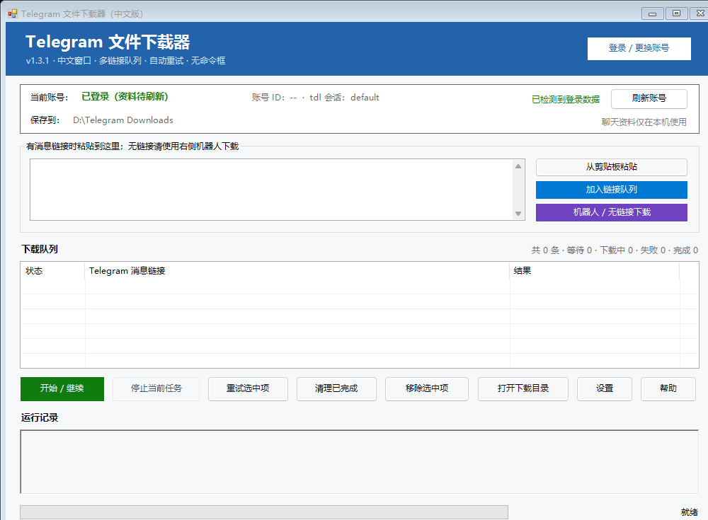

# tdl Chinese GUI

[English](README_EN.md) · [常见问题](docs/FAQ.md) · [问题反馈](https://github.com/fromChina-001/tdl-chinese-gui/issues) · [上游 tdl](https://github.com/iyear/tdl)

> 一个面向 Windows 用户的 Telegram 媒体下载中文图形界面，底层使用优秀的开源项目 [iyear/tdl](https://github.com/iyear/tdl)。

## 原项目出处与版权归属

本项目的 Telegram 登录、消息解析和文件传输等核心能力来自上游开源项目 **[iyear/tdl](https://github.com/iyear/tdl)**。

| 项目 | 信息 |
| --- | --- |
| 原项目 | [iyear/tdl](https://github.com/iyear/tdl) |
| 原作者 | [iyear](https://github.com/iyear) 及 tdl 贡献者 |
| 本项目测试的上游版本 | [tdl v0.20.4](https://github.com/iyear/tdl/releases/tag/v0.20.4) |
| 上游许可证 | [GNU AGPL v3.0](https://github.com/iyear/tdl/blob/master/LICENSE) |
| 本项目定位 | 为 tdl 提供的非官方 Windows 中文图形界面 |

本项目不声称拥有 tdl 的核心代码或品牌。仓库只提供独立的图形界面与安装脚本；**tdl.exe 由安装器从上游官方 GitHub Release 下载并校验 SHA-256**。更完整的出处、分工与许可证说明见 [UPSTREAM.md](UPSTREAM.md) 和 [THIRD_PARTY_NOTICES.md](THIRD_PARTY_NOTICES.md)。

## 为什么做这个项目

tdl 功能强大，但原版主要通过命令行使用。本项目为它增加了中文 Windows 窗口，让不熟悉命令行的用户也能扫码登录、粘贴消息链接并连续下载。

## 主要功能

- 全中文图形界面，不弹出命令行窗口
- 首次使用向导；缺少 tdl.exe 时可直接启动一键安装器
- 在窗口内完成 Telegram 二维码登录
- 显示当前账号名称、账号 ID 和连接状态
- 可粘贴一整段文字，自动识别其中的 Telegram 消息链接
- 新增机器人 / 受保护聊天下载：无需消息链接，自动读取聊天列表并下载最近媒体
- 多链接队列连续下载，下载完成后窗口不会退出
- 队列支持统计、重试、删除和打开 Telegram 原消息
- 失败原因尽量转换成易懂的中文，并按设置自动重试
- 自动保存未完成队列，下次启动继续处理
- 下载完成后可显示 Windows 系统通知
- 可配置下载目录、代理、线程、并发和媒体组下载

## 一键安装

### 方法一：下载源码压缩包

1. 点击 GitHub 页面右上角 **Code → Download ZIP**。
2. 解压到一个长期保留的目录，不要直接在压缩包内运行。
3. 双击 **一键安装或更新.bat**。
4. 安装完成后使用桌面快捷方式或目录内的 **Telegram下载器（中文版）.lnk**。

安装器会从 tdl 官方 Release 下载经过测试的 Windows 64 位版本。再次运行安装器时，如果版本正确会跳过重复下载。

### 方法二：Git 克隆

~~~powershell
git clone https://github.com/fromChina-001/tdl-chinese-gui.git
cd tdl-chinese-gui
powershell -ExecutionPolicy Bypass -File .\一键安装或更新.ps1 -Launch
~~~

如果 GitHub 下载需要本地代理：

~~~powershell
powershell -ExecutionPolicy Bypass -File .\一键安装或更新.ps1 -Proxy 'http://127.0.0.1:7890' -Launch
~~~

## 使用方法

1. 点击右上角 **登录 / 更换账号**。
2. 在手机 Telegram 中进入 **设置 → 设备 → 链接桌面设备**，扫描窗口中的二维码。
3. 有消息链接时：粘贴单条、多条或包含链接的文字，点击 **加入链接队列**。
4. 机器人或受保护聊天没有链接时：点击 **机器人 / 无链接下载**。
5. 在新窗口中选择机器人；机器人会自动排在列表最前。
6. 默认下载最近 1 个媒体，也可改成最近 5/10 个；普通文字消息会被自动忽略。
7. 下载期间不要同时运行另一个 tdl 实例，以免登录数据被占用。

默认下载位置是项目目录下的 **downloads** 文件夹。代理默认关闭；如有需要，请在 **设置** 中启用并填写你的实际代理地址。

## 常见问题

安装失败、二维码不显示、链接无法复制、消息无权访问、SmartScreen 提示等问题，请查看 [常见问题与排查](docs/FAQ.md)。

## 隐私与安全

以下内容已被 Git 忽略，不会被上传到仓库：

- Telegram 登录会话
- 当前账号名称和账号 ID 缓存
- 消息链接下载队列
- 本地代理与下载设置
- 下载的图片、视频和文件
- 临时运行日志及 tdl.exe

tdl 的登录会话默认保存在当前 Windows 用户目录的 **.tdl** 文件夹中。本项目不会要求用户上传会话文件。界面会隐藏完整消息链接，但提交截图或 Issue 前仍应自行检查敏感信息。

## 能力边界

- 本项目不能绕过 Telegram 的账号权限。
- 只有当前登录账号能够查看的消息，才可能被下载。
- 已被 Telegram 删除且账号无法再访问的文件，无法恢复。
- 请只下载你有权保存的内容，并遵守当地法律、群组规则与内容版权。
- 本项目不是 Telegram 官方客户端，也不隶属于 Telegram 或 tdl 作者。

## 项目文件

| 文件 | 用途 |
| --- | --- |
| tdl-gui.ps1 | 中文图形界面主程序 |
| 启动中文版下载器.vbs | 无命令框启动入口 |
| 一键安装或更新.ps1 | 下载、校验并安装 tdl |
| 一键安装或更新.bat | 方便双击执行安装 |
| docs/FAQ.md | 常见问题与排查 |
| SECURITY.md | 隐私和安全说明 |
| THIRD_PARTY_NOTICES.md | 第三方项目与许可证说明 |
| UPSTREAM.md | 原项目出处、分工和版本信息 |

## 已测试环境

- Windows 10 / Windows 11 64 位
- Windows PowerShell 5.1
- tdl v0.20.4
- HTTP 代理与直连网络

## 参与贡献

欢迎提交 Issue 或 Pull Request。反馈问题时，请隐藏 Telegram 消息链接、手机号、账号 ID、代理密码和会话文件。

## 致谢

核心下载能力来自 [iyear/tdl](https://github.com/iyear/tdl)。感谢其作者和贡献者提供优秀的 Telegram 下载工具。

## 开源许可

本项目采用 [GNU Affero General Public License v3.0](LICENSE)。上游 tdl 同样采用 AGPL-3.0，详细说明见 [THIRD_PARTY_NOTICES.md](THIRD_PARTY_NOTICES.md)。